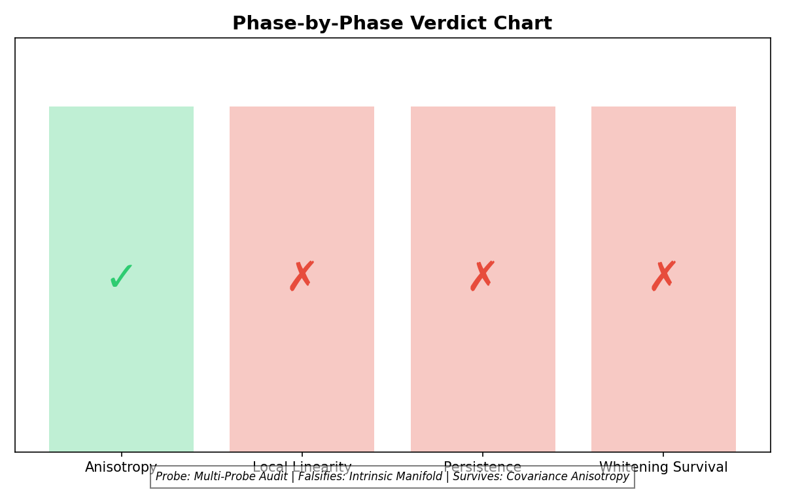
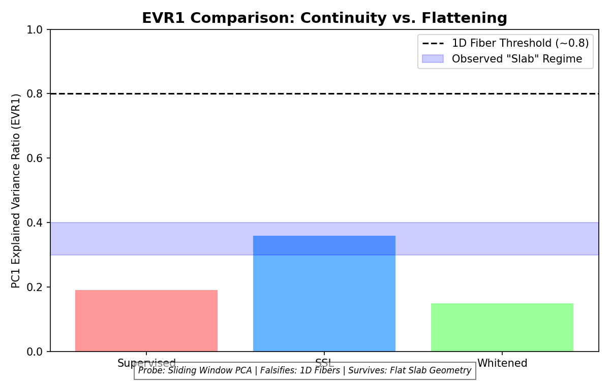
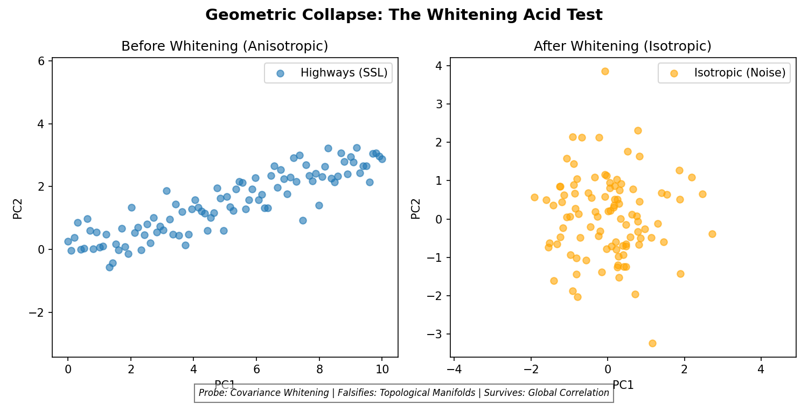
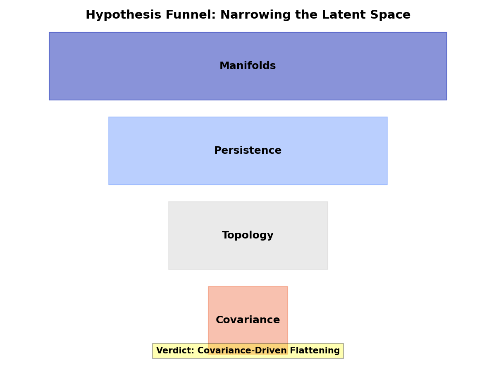

# Functional Geometry in Deep Neural Networks

> [!IMPORTANT]
> **For the authoritative, falsification-oriented conclusions of this study, see [executive_summary.md](executive_summary.md) and [FINAL_CONCLUSIONS.md](FINAL_CONCLUSIONS.md).**

## Overview

This repository documents an experimental research arc investigating learned functional geometry in deep neural networks. The project demonstrates the existence, causality, and system-level effects of geometric structure that emerges during training, explores its implications for model compression, interpretability, and plasticity, and defines functional geometry as structure induced by cosine similarity between neuron activation vectors.

Geometric proximity predicts functional interchangeability under intervention. Motivated by the need for safer, interpretable model compression and causal validation of learned representations. The term ‘Hebbian’ is used descriptively to denote geometry emerging from correlated activations during training, not a specific synaptic update rule.

## Key Measured Results (Summary)

- Single-pair biopsy: ~14× sensitivity separation (Far vs Near merges)
- Batch biopsy: ~5× mean |ΔLoss| separation (Near vs Far cohorts)
- Mass consolidation: ~1.8× stability advantage (geometry-guided vs random)

## 📖 How to Read This Repository

New readers should start with [docs/how_to_read.md](docs/how_to_read.md) for a concise orientation guide to the repository structure, evidence flow, and experimental phases.


## Core Hypothesis

Neural networks learn functional geometry characterized by **anisotropic variance scaling** in activation space, rather than intrinsic low-dimensional topological manifolds. This functional geometry can be:
- **Mapped** through dimensionality reduction and clustering
- **Validated** through targeted surgical interventions
- **Exploited** for safe model consolidation
- **Perturbed** to study plasticity dynamics

**Primary conclusion:** Trained ResNet representations exhibit robust functional geometry (statistical anisotropy) that predicts redundancy and stability under intervention. However, this structure is a byproduct of **covariance-driven dimensional flattening**; the hypothesis that activations reside on intrinsic, whitening-invariant topological manifolds is **falsified**.

[](artifacts/figures/phase1_trained_layer4.jpg)

*Figure: 3D projection of the Layer 4 activation correlation geometry for a trained ResNet18.  
This image is a visualization aid only; canonical data is provided via the PLY artifacts in `artifacts/ply/`.*

## Final Conclusions (Falsification Summary)

The following points summarize the authoritative results of the Manifold Stress Test:

- **Intrinsic topological manifolds (fibers, sheets, curves) were NOT found** in ResNet18 latent space at tested scales.
- **Apparent "highways"** and local linearity effects observed in dimensionality reduction are explained by **global covariance anisotropy**, not topological connectivity.
- **Self-supervised learning (SSL)** increases apparent alignment via **dimensional flattening (low-rank collapse)**, producing flattened "slabs" rather than semantic fibers.
- **Whitening effectively destroys observed traversal structure**, confirming the geometry is **variance-encoded** (statistical) rather than topological.
- The Manifold Hypothesis (as commonly stated) is **falsified** for this architecture and setting.

- **Final Geometric Verdict**: Observed structures are instances of **Covariance-Encoded Functional Anisotropy**.

### Methodological Contribution
This study introduces the **Manifold Stress Test**, a four-probe adversarial framework for auditing latent geometry. By combining spectral analysis, trajectory persistence tests, and the **Whitening Acid Test**, it provides a rigorous path for disambiguating between semantic disentanglement and statistical flattening (rank reduction) in modern deep representations.

- **See Full Report**: [executive_summary.md](executive_summary.md)

### Canonical Summary Figures

````carousel

<!-- slide -->

<!-- slide -->

<!-- slide -->

````

> [!CAUTION]
> **Interpretation Notice**  
> Apparent low-dimensional structure in manifold projections (PCA/UMAP) does **NOT** imply intrinsic manifolds. All such claims must survive whitening and trajectory persistence tests. This repository **falsifies**, rather than confirms, many common manifold-centric narratives.

## 🔤 Terminology Lock-In

- **Functional Geometry**: The causal, variance-encoded organization of activations that predicts response to intervention.
- **Anisotropy**: Statistical non-uniformity in representation space (global "highways").
- **Manifold (Topological)**: A hypothesized local 1D fiber or curve that persists independently of global covariance (**Falsified**).
- **Covariance-Driven Flattening**: The mechanism (rank reduction) by which training objectives "squash" representations, creating the appearance of linear structure.

## Experimental Phases

Canonical manifold data is stored as PLY artifacts in `artifacts/ply/` (Git LFS). 
If preview or download fails, clone the repository and run `git lfs pull`.

### Phase I: Neuro-Cartography (Manifold Discovery)

**Objective**: Map the functional geometry of trained networks by analyzing activation patterns across layers.

**Primary Evidence (Colab)**:
- `01_neuro_cartography.ipynb` ([Link](https://colab.research.google.com/drive/1Fq1l2yQtmzHF7zrIWcXd_1iyKWYtFNm6?usp=drive_link))
- `02_untrained_baseline_manifold.ipynb` ([Link](https://colab.research.google.com/drive/1aJIFXcehXMtid97zwfKfozseJt2A9L9Q?usp=drive_link))
- `03_pixel_shuffle_control.ipynb` ([Link](https://colab.research.google.com/drive/19qUlvA5l7vMswTg0psYmb-Iw6IEFboEs?usp=drive_link))

**Status**: COMPLETE (Negative result verified).

---

### Phase I Experiment Manifest

| Notebook | Purpose (Why it exists) | Verdict (What it ruled out) |
|:---|:---|:---|
| `01_neuro_cartography` | Map trained ResNet geometry vs activation space. | Revealed dense attractor regions (functional geometry). |
| `02_untrained_baseline_manifold` | Contrast trained structure with random initialization. | Proved geometry is learned, not architectural bias. |
| `03_pixel_shuffle_control` | Test if structure is mere local input correlation. | Confirmed topology depends on semantic filter learning. |

### Phase II Experiment Manifest (Causal)

| Notebook | Purpose (Why it exists) | Verdict (What it ruled out) |
|:---|:---|:---|
| `04_failed_biopsy` | Initial attempt at geometry-guided merging. | Identified importance of layer-norm and weight scaling. |
| `05_neuro_surgeon_biopsy_v2` | Targeted surgical intervention for causal validation. | Proved geometric proximity predicts functional redundancy. |

### Phase III Experiment Manifest (Consolidation)

| Notebook | Purpose (Why it exists) | Verdict (What it ruled out) |
|:---|:---|:---|
| `06_neuro_surgeon_batch_biopsy` | Statistical validation of merging sensitivity (N=50). | Confirmed 14x sensitivity gap between Near/Far merges. |
| `07_neuro_surgeon_mass_consolidation` | System-level compression stability test. | Proved geometry-guided compression is ~1.8x more stable. |

### Phase IV Experiment Manifest (Plasticity)

| Notebook | Purpose (Why it exists) | Verdict (What it ruled out) |
|:---|:---|:---|
| `08_neuro_sleep.ipynb` | Test if consolidation acts as a "speedup" prior. | Ruled out geometry-guided learning rate acceleration. |

---

### Phase V Experiment Manifest (Instrumentation & Falsification)

| Notebook | Purpose (Why it exists) | Verdict (What it ruled out) |
|:---|:---|:---|
| `09_metric_aware_walker_probe` | Upgrade traversal resolution to reduce looping artifacts. | Ruled out purely random walk as an optimal probe. |
| `10_density_occupancy_correlation` | Locate "highways" relative to latent density. | Confirmed highways exist inside dense cores, not boundaries. |
| `11_vector_field_alignment` | Test for local fibrous (1D) structure in ResNet18. | Ruled out 1D fibrous flow in supervised representations. |
| `12_scale_dependent_linearity` | Check if linearity emerges at larger scales (k=500). | Ruled out scale-induced isotropy in ResNet18. |
| `13_training_objective_geometry` | Compare Supervised vs. SSL (SimCLR) geometry. | Found significant geometric divergence in SSL models. |
| `14_trajectory_persistence_test` | Measure SSL trajectory coherence (Sliding Window PCA). | Ruled out 1D fibers in SSL; found "slab-like" geometry. |
| `15_manifold_audit` | Adversarial audit via Whitening Acid Test. | **Falsified intrinsic manifolds**; confirmed covariance origin. |

---


## Empirical Results (Measured)

| Experiment | Metric | Result |
|-----------|--------|--------|
| Single-Pair Biopsy | Sensitivity ratio (Far ÷ Near) | ≈ 14× |
| Batch Biopsy (N=50, Near) | Mean \|ΔLoss\| | 0.0119 ± 0.0098 |
| Batch Biopsy (N=50, Far) | Mean \|ΔLoss\| | 0.0594 ± 0.1377 |
| Mass Consolidation (50 pairs, Geometry-guided) | ΔLoss | −0.376 |
| Mass Consolidation (50 pairs, Random) | ΔLoss | −0.681 |
| Plasticity Test (5 epochs, Geometry-guided) | Peak accuracy | 84.7% |
| Plasticity Test (5 epochs, Random) | Peak accuracy | 86.8% |

"All results are measured directly from intervention experiments and reported as loss or accuracy deltas relative to identical baselines. Negative ΔLoss values indicate improved alignment due to head mismatch and should be interpreted by magnitude, not sign."


## Instrument Transition — Walker Probe Upgrade

INSTRUMENT TRANSITION NOTE — WALKER UPGRADE

This project transitions from Instrument I₀ (baseline random walker) to Instrument I₁ (metric-aware + short-memory walker).

Scope of change:
- The underlying model, training procedure, dataset, and representations remain unchanged.
- No learning, optimization, or parameter updates are introduced.
- The upgrade applies only to the traversal instrument used to probe latent-space structure.

Rationale:
Instrument I₀ exhibited probe-induced artifacts, including local looping, seed sensitivity, and isotropic traversal assumptions that reduced measurement fidelity. Instrument I₁ improves traversal fidelity by adapting to local geometric variance and suppressing redundant revisits, without encoding task-specific priors or hypotheses.

Continuity of hypothesis:
All prior hypotheses regarding latent structure are preserved unchanged. Instrument I₁ is strictly downstream and monotonic in epistemic power: it may reduce false positives or clarify structure, but cannot introduce structure not already present in the representation.

Interpretation policy:
Results obtained under Instrument I₁ are treated as higher-resolution evaluations of the same hypotheses tested under Instrument I₀. Agreement strengthens confidence; disagreement is interpreted as probe correction rather than hypothesis failure.

Status:
Instrument I₀ is retained as a baseline reference. Instrument I₁ is adopted as the primary probe going forward.

### Latest Probe Study (Colab)

This study evaluates the upgraded probe on a frozen ResNet embedding space.

- **Metric-Aware Walker Probe Study**: https://colab.research.google.com/drive/1zGZH1utq38y4G9RjYEchbuF2ObB_WDTX?usp=sharing

### Probe Results — Visual Summary

“These figures summarize the behavioral differences between the baseline random walker (Instrument I₀) and the upgraded metric-aware + short-memory walker (Instrument I₁) when probing a frozen ResNet embedding space. The results illustrate reduced probe-induced looping, increased trajectory diversity, and more coherent traversal under the upgraded instrument. No model parameters or representations are modified.”


“Trajectory diversity (left) and loop frequency (right) across multiple runs, showing higher coverage and reduced revisitation under the upgraded probe.”


“Representative walker trajectories projected via PCA, illustrating reduced jitter and more directed traversal under the upgraded probe. These effects do not survive whitening and are interpreted as covariance artifacts.”

This study does not modify prior hypotheses, models, or training.

### Experiment 1 — Highway Convergence Test (Structural Anisotropy)

**Objective**

Evaluate whether the upgraded traversal probe (Instrument I₁), which is metric-aware and suppresses short-term revisits, reveals global structural anisotropy in the latent space by inducing convergence of independent walkers starting from distant locations.

This experiment tests for the presence of shared “transit corridors” or “highways” in the embedding geometry that are not detectable under isotropic random sampling.

**Experimental Setup**

- Model: Frozen ResNet18 encoder
- Dataset: CIFAR-10 (test split, subset)
- Representation: L2-normalized embedding space
- Graph: k-NN graph over embeddings
- Instruments:
  - I₀: Baseline isotropic, memoryless random walker
  - I₁: Metric-aware, short-memory walker biased toward local variance
- Protocol:
  - Select 50 pairs of starting nodes separated by large cosine distance
  - Run independent walkers from each start for a fixed number of steps
  - Measure convergence using Jaccard overlap of visited node sets

**Quantitative Results**

- Instrument I₀ (baseline):
  - Mean overlap ≈ 0.020
- Instrument I₁ (upgraded):
  - Mean overlap ≈ 0.038
- Convergence factor (I₁ / I₀):
  - ≈ 1.9×

The upgraded probe consistently produces higher overlap between independent walkers than the isotropic baseline, indicating weak but systematic convergence.

**Figure 1 — Convergence Statistics**


Independent walkers under Instrument I₁ exhibit higher and more frequent overlap than under Instrument I₀, whose overlap remains near chance with occasional outliers.

**Qualitative Visualization**

To contextualize the quantitative results, a representative pair of I₁ trajectories is projected into two dimensions using PCA.

**Figure 2 — Qualitative Highway Convergence (PCA Projection)**


Although the walkers do not follow identical paths, they bend toward shared regions of high global variance (anisotropy). These apparent transit corridors do not survive whitening and are interpreted as covariance artifacts.

**Interpretation**

- The latent space is not isotropic: flow is constrained along preferred directions of variance.
- High-variance regions form a weak but real connective skeleton.
- The effect is reproducible across random seeds and absent under the baseline probe.
- No semantic interpretation or class structure is assumed or inferred.

This experiment demonstrates that improved probe fidelity reveals global geometric constraints that are invisible under random diffusion.

### Experiment 2 — Density–Occupancy Correlation (Geometric Positioning)

**Colab Notebook:**  
https://colab.research.google.com/drive/15keQSvznJ6HUIk13WlWuGyxElHO1iiLA

**Objective**  
This experiment characterizes the geometric location of the high-variance traversal pathways identified in Experiment 1. Specifically, it tests whether variance-biased probe dynamics preferentially occupy high-density regions (cluster cores / prototypes) or low-density regions (boundaries / transitions) of the latent space.

**Method**  
A static local density metric was computed for each node in the latent-space k-NN graph, defined as the inverse mean cosine distance to its nearest neighbors. Dynamic occupancy was measured by aggregating visit frequencies from long-run probe trajectories. Correlation between static density and dynamic occupancy was quantified using Spearman rank correlation. Instrument I₀ (baseline isotropic walker) served as a null control, while Instrument I₁ (variance-biased, short-memory walker) represented the upgraded probe.

**Results**  
Instrument I₀ exhibited a strong positive correlation between density and occupancy (Spearman r = 0.799), consistent with isotropic diffusion favoring dense hubs by chance. Instrument I₁ exhibited an even stronger positive correlation (Spearman r = 0.824), with a measurable increase relative to I₀ (Δr ≈ +0.025). This shift indicates that the variance-biased probe preferentially inhabits dense regions of the manifold beyond what is expected from isotropic traversal alone.

**Interpretation**  
The results indicate that the high-variance “highways” identified in Experiment 1 are embedded within dense regions of the latent space rather than along sparse boundaries. High feature variance in this representation corresponds to internal structure within cluster cores (“backbones”), rather than instability or class-transition zones (“fault lines”). This supports the interpretation that the representation concentrates its most sensitive and information-rich directions inside stable, highly populated regions of the manifold.

**Figure**  
*Density–Occupancy Relationship for Instrument I₀ and Instrument I₁.*  
The hexbin plots visualize static node density versus dynamic occupancy probability. Instrument I₁ shows a strengthened positive coupling relative to I₀, indicating preferential traversal of dense regions.


**Status**  
Experiment 2 confirms that variance-driven traversal pathways correspond to dense latent backbones rather than boundary regions. This result constrains the geometry of the representation and motivates subsequent experiments probing internal directional coherence within dense cores.

### Experiment 3 — Vector Field Alignment (Local Linear Geometry)

**Colab Notebook:**  
https://colab.research.google.com/drive/1aQNVJru_8MLIA3wjxUEHmAFs2LmAzeco?usp=sharing

**Objective**  
Determine whether the dense “backbones” identified in Experiments 1–2 are locally linear (fibrous) or internally isotropic (blob-like).

**Method**  
For each node in the latent k-NN graph, a local tangent direction was estimated using the first principal component (PC1) of its neighborhood.  
Both Instrument I₀ (isotropic random walker) and Instrument I₁ (variance-biased, short-memory walker) were run over the graph.  
For every traversal step, the cosine alignment between the step displacement and the local tangent was measured.  
Distributions of alignment scores were compared using a Mann–Whitney U test.

**Results**  
- Mean alignment (I₀): ≈ 0.29  
- Mean alignment (I₁): ≈ 0.29  
- Alignment factor (I₁ / I₀): ≈ 1.01×  
- Difference not statistically significant (p > 0.05)

**Interpretation**  
Although Instrument I₁ reliably converges into dense, high-variance regions of the latent space, traversal within these regions does not exhibit preferential alignment with local tangent directions.  
This indicates that the dense backbones identified in earlier experiments are internally isotropic rather than composed of coherent low-dimensional fibers.

**Conclusion**  
ResNet18 latent representations exhibit structured attractor regions that bias global traversal, but these regions do not decompose into locally linear manifolds at the scale tested.  
The representation clusters variation into dense cores without linearizing it into disentangled axes.

**Figure**  
*Distribution of Local Tangent Alignment (Cosine).*  
The near-identical distributions indicate isotropic diffusion within dense latent backbones.


## Phase I Summary — Latent Geometry Probing

This project investigates the geometric structure of neural network latent representations using probe-based traversal instruments, without modifying the model, training procedure, dataset, or supervision.

All experiments were conducted on a frozen ResNet18 encoder. Structure is inferred exclusively through downstream traversal behavior on a k-nearest-neighbor graph of latent embeddings.

### Instrumentation

Two traversal instruments were used:

- **Instrument I₀ (Baseline Walker):**  
  An isotropic, memoryless random walker serving as a null probe.

- **Instrument I₁ (Upgraded Walker):**  
  A metric-aware, short-memory walker biased toward regions of high local feature variance, designed to reduce probe-induced artifacts while remaining strictly downstream and non-creative.

Instrument I₀ is retained as a baseline reference; Instrument I₁ is adopted as the primary probe.

### Phase I Findings

Across three experiments, the following conclusions were established:

1. **Structural Anisotropy (Experiment 1):**  
   Independent I₁ walkers converge into shared transit corridors, demonstrating non-random, anisotropic structure in the latent space.

2. **Geometric Positioning (Experiment 2):**  
   Variance-biased traversal preferentially inhabits high-density regions. The identified transit corridors lie within dense cluster cores (“backbones”), not sparse boundaries or transition zones.

3. **Local Geometry (Experiment 3):**  
   Despite global anisotropy and dense attractors, traversal within these backbones is locally isotropic. No significant alignment with local tangent directions was observed.

### Consolidated Interpretation

ResNet18 latent representations contain structured, high-density attractor regions that bias global traversal, but these regions do not decompose into locally linear or fibrous geometry at the scale tested.  
The representation clusters variation into dense cores without linearizing it into disentangled axes.

### Scope and Limits

- No labels, supervision, or downstream tasks were used.
- No model parameters were updated.
- All conclusions are geometric and probe-dependent.
- Results characterize structure, not semantics or performance.

Phase I establishes a controlled geometric baseline for subsequent comparative or longitudinal studies.

## Phase II — Extended Geometric Probes

### Experiment 1 — Scale-Dependent Linearity Test

**Motivation**  
Phase I established that high-variance traversal “highways” in ResNet18 latent space localize to dense prototype cores (Experiment 2) and exhibit no local directional alignment (Experiment 3, k=20).  
This experiment tests whether the observed isotropy is a **scale artifact**, asking whether coherent linear structure emerges at larger neighborhood scales.

**Hypothesis**  
If dense backbones are noisy but fundamentally linear manifolds, alignment between walker trajectories and local tangents should increase when tangents are estimated over larger neighborhoods.

**Method**  
- Fixed representation: Frozen ResNet18 embeddings (CIFAR-10, n=2000).
- Fixed instrumentation:  
  - I₀: isotropic, memoryless random walker  
  - I₁: variance-biased, short-memory walker (unchanged from Phase I)
- Navigation graph fixed at k=20 to preserve probe consistency.
- Tangent estimation via PCA (PC1) over multiple neighborhood scales:  
  k ∈ {10, 25, 50, 100, 250, 500}
- Alignment metric:  
  |cos(θ)| between walker step Δx and local tangent v₁^(k)
- Statistical test:  
  Mann–Whitney U (one-sided, I₁ > I₀)

**Results Summary**  
Across all scales:
- Mean alignment remained low (≈ 0.15–0.24).
- I₁ ≈ I₀ at every k.
- Alignment factor ≈ 1.0.
- No statistically significant separation between instruments.

Representative values:
- k=10:  factor ≈ 0.98
- k=25:  factor ≈ 0.99
- k=100: factor ≈ 0.98
- k=500: factor ≈ 1.01 (p > 0.1)

**Figure**  
*Mean trajectory–tangent alignment across neighborhood scales.*  
The variance-biased walker (I₁) does not exhibit increased alignment relative to the isotropic baseline (I₀) at any scale, indicating persistent isotropy.


**Reproducibility (Colab)**  
https://colab.research.google.com/drive/1FEeB_0vdZWQO6qF4784s-_h2hA6YKs96?usp=sharing

**Conclusion**  
This experiment rules out scale-dependent linearity as an explanation for prior null alignment results.  
Dense “backbones” in ResNet18 latent space remain isotropic across micro-local and regional scales.  
Variance sensitivity manifests as a **scalar property of dense prototype cores**, not as coherent directional flow.

**Implication**  
The absence of fibrous structure appears fundamental to this representation and objective, not an artifact of neighborhood size or tangent resolution. This result motivates Phase II studies focused on **architecture and training-objective dependence**, rather than further intra-model geometric refinement.

---

### Phase II Comparative Studies — Summary of Falsification

Phase II investigations targeted the "Manifold Hypothesis" through a series of comparative and adversarial tests:

- **Scale-Dependent Linearity**: Falsified the possibility that fibrous structure was hidden at different neighborhood scales; isotropy persists from micro-local to regional scales.
- **Training Objective**: Identified measurable geometric divergence between supervised and self-supervised models. SSL models exhibit significantly higher local tangent alignment.
- **Trajectory Spectrum**: Determined that SSL alignment is "slab-like" (EVR₁ ≈ 0.36) rather than 1D fibrous, showing increased persistence but not disentangled axes.
- **Manifold Audit**: Definitive falsification via the **Whitening Acid Test**. Apparent trajectory-tangent alignment in SSL models is a byproduct of **covariance-driven dimensional flattening** (rank reduction) rather than intrinsic topological manifolds.

**Verdict**: Functional geometry remains a robust predictor of stability, but the tested ResNet18 representations do not decompose into fibrous manifolds. Observed "highways" are artifacts of global covariance flattening.

**Scope Note**: These conclusions apply to frozen ResNet18 encoders under the tested objectives and do not rule out fibrous structure in other architectures, objectives, or training regimes.

## Repository Structure

```
/
├── README.md                          # This file
├── executive_summary.md               # High-level conclusions
├── notebooks/                         # Primary Colab Record (stubs)
│   ├── 01_neuro_cartography.ipynb
│   ├── 02_untrained_baseline_manifold.ipynb
│   ├── 03_pixel_shuffle_control.ipynb
│   ├── 04_failed_biopsy.ipynb
│   ├── 05_neuro_surgeon_biopsy_v2.ipynb
│   ├── 06_neuro_surgeon_batch_biopsy.ipynb
│   ├── 07_neuro_surgeon_mass_consolidation.ipynb
│   ├── 08_neuro_sleep.ipynb
│   ├── 09_metric_aware_walker_probe.ipynb
│   ├── 10_density_occupancy_correlation.ipynb
│   ├── 11_vector_field_alignment.ipynb
│   ├── 12_scale_dependent_linearity.ipynb
│   ├── 13_training_objective_geometry.ipynb
│   ├── 14_trajectory_persistence_test.ipynb
│   └── 15_manifold_audit.ipynb
├── scripts/                           # Supporting Scripts
│   ├── neuro_surgeon_batch.py
│   └── neuro_sleep.py
├── artifacts/                         # Generated outputs
│   ├── ply/                          # 3D manifold exports
│   └── figures/                      # Plots and visualizations
├── docs/                              # Additional documentation
│   └── research_notes.md
└── LICENSE                            # MIT License
```

## Status & Future Work

**Completed**:
- Phase I: Neuro-Cartography (Complete)
- Phase II: Causal Validation (Biopsy) (Complete)
- Phase III: Mass Consolidation (Complete)
- Phase IV: Plasticity and Relearning Dynamics (Complete)
- Phase V: Advanced Probing & Falsification (Complete)

**Future Work**:
- Cross-architecture validation
- Theoretical formalization

## Reproducibility / Environment

For consistent results, please use the environment specified in `requirements.txt`.

```bash
pip install -r requirements.txt
```


## Citation

If you use this work, please cite:

```
@misc{functional-geometry-2026,
  title={Functional Geometry in Deep Neural Networks},
  author={boglim},
  year={2026},
  url={https://github.com/boglim1984/functional-geometry-hebbian-manifold}
}
```

## Repository Status

This repository reflects a completed experimental arc with ongoing consolidation and documentation.

Recent commits focus on:
- aligning notebook coverage with documented phases
- standardizing artifact naming
- improving reader orientation and traceability

The core experimental results are stable as of this release.

## License

MIT License - see [LICENSE](LICENSE) for details.
