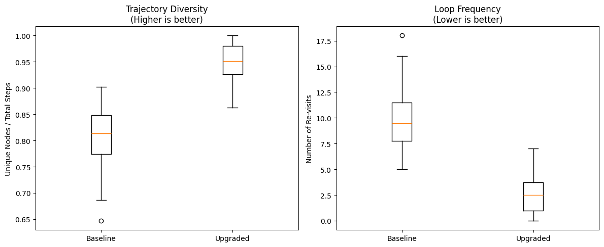
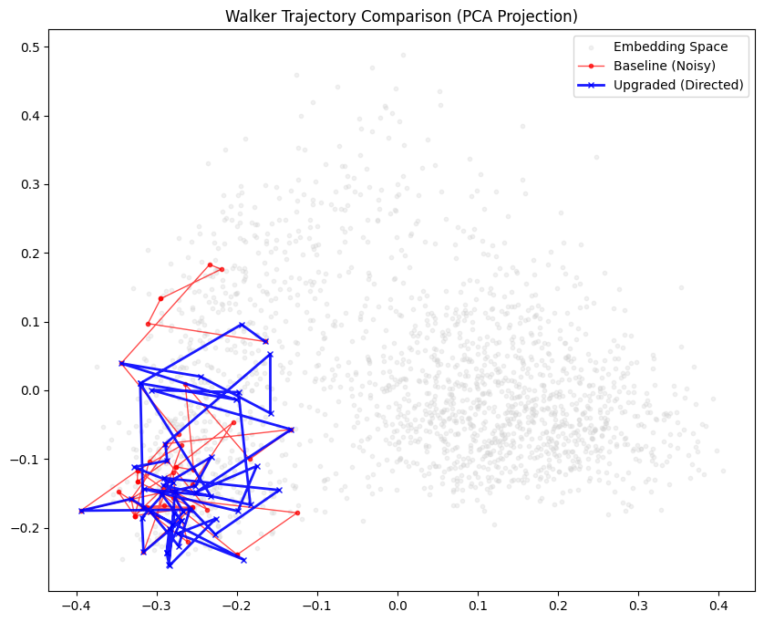
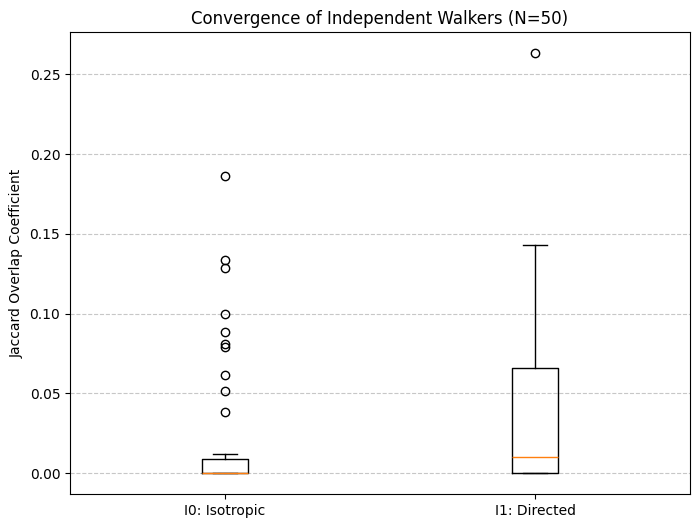
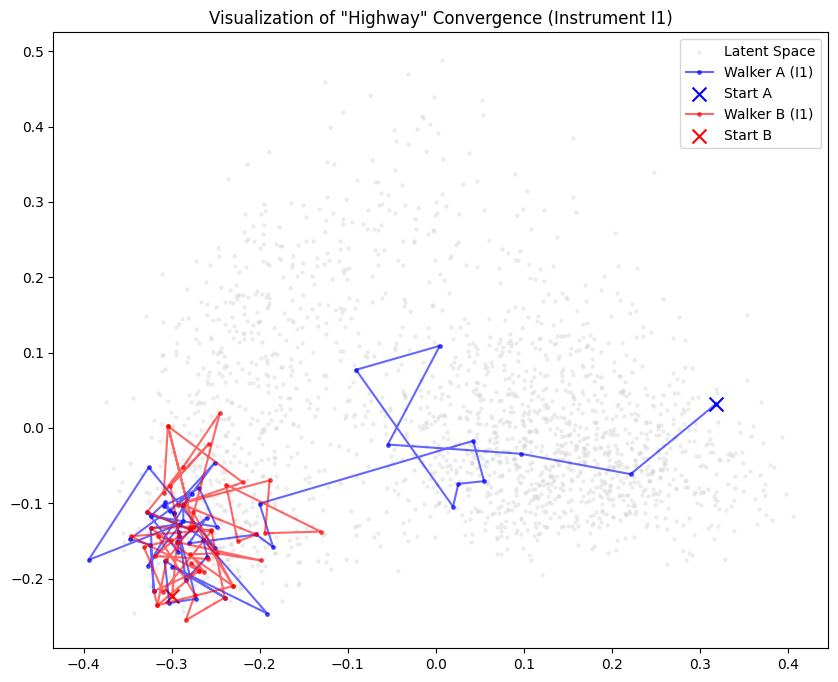
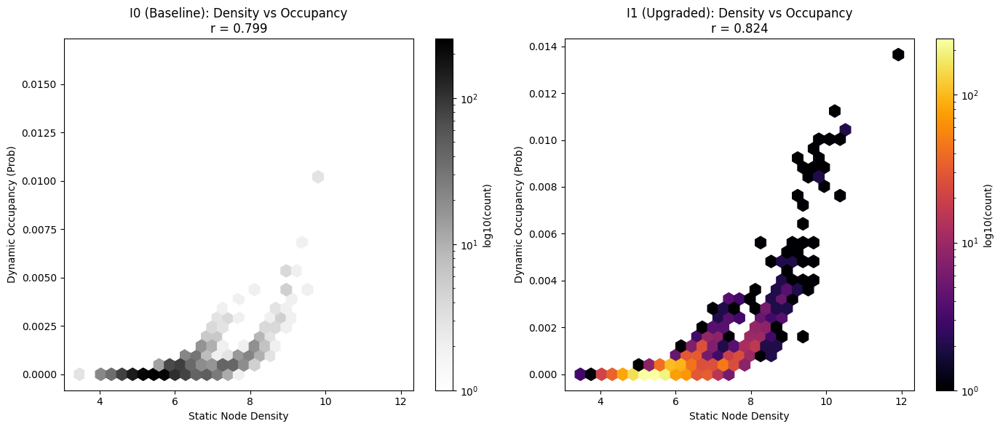
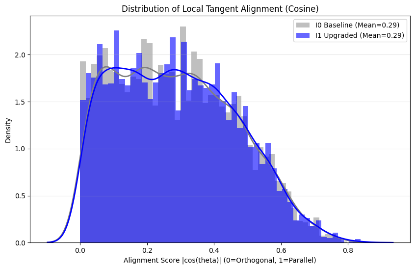
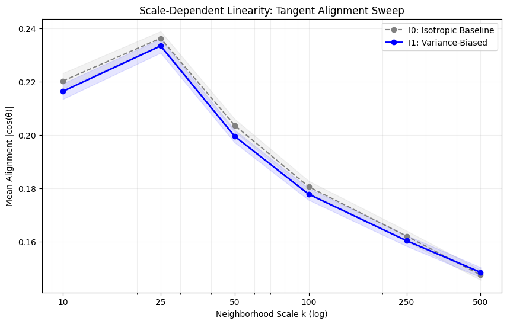
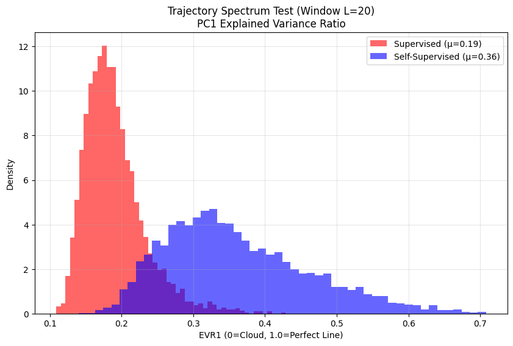
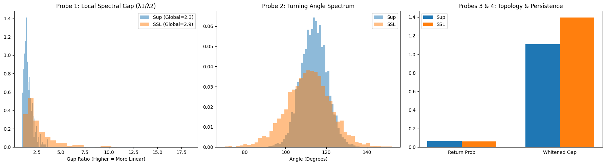

# Functional Geometry in Deep Neural Networks

## Overview

This repository documents an experimental research arc investigating learned functional geometry in deep neural networks. The project demonstrates the existence, causality, and system-level effects of geometric structure that emerges during training, explores its implications for model compression, interpretability, and plasticity, and defines functional geometry as structure induced by cosine similarity between neuron activation vectors.

Geometric proximity predicts functional interchangeability under intervention. Motivated by the need for safer, interpretable model compression and causal validation of learned representations. The term ‘Hebbian’ is used descriptively to denote geometry emerging from correlated activations during training, not a specific synaptic update rule.

## Key Measured Results (Summary)

- Single-pair biopsy: ~14× sensitivity separation (Far vs Near merges)
- Batch biopsy: ~5× mean |ΔLoss| separation (Near vs Far cohorts)
- Mass consolidation: ~1.8× stability advantage (geometry-guided vs random)

## 📖 How to Read This Repository

New readers should start with [docs/how_to_read.md](docs/how_to_read.md) for a concise orientation guide to the repository structure, evidence flow, and experimental phases.


## Core Hypothesis

Neural networks learn functional geometry—structured manifolds in activation space that encode redundancy, stiffness, and causal relationships between neurons. This geometry can be:
- **Mapped** through dimensionality reduction and clustering
- **Validated** through targeted surgical interventions
- **Exploited** for safe model consolidation
- **Perturbed** to study plasticity dynamics

[](artifacts/figures/phase1_trained_layer4.jpg)

*Figure: 3D projection of the Layer 4 activation correlation manifold for a trained ResNet18.  
This image is a visualization aid only; canonical data is provided via the PLY artifacts in `artifacts/ply/`.*

## Experimental Phases

Canonical manifold data is stored as PLY artifacts in `artifacts/ply/` (Git LFS). 
If preview or download fails, clone the repository and run `git lfs pull`.

### Phase I: Neuro-Cartography (Manifold Discovery)

**Objective**: Map the functional geometry of trained networks by analyzing activation patterns across layers.

**Primary Evidence (Colab)**:
- `01_neuro_cartography.ipynb` ([Link](https://colab.research.google.com/drive/1Fq1l2yQtmzHF7zrIWcXd_1iyKWYtFNm6?usp=drive_link))
- `02_untrained_baseline_manifold.ipynb` ([Link](https://colab.research.google.com/drive/1aJIFXcehXMtid97zwfKfozseJt2A9L9Q?usp=drive_link))
- `03_pixel_shuffle_control.ipynb` ([Link](https://colab.research.google.com/drive/19qUlvA5l7vMswTg0psYmb-Iw6IEFboEs?usp=drive_link))

**Phase I Visual Previews**

- **01_neuro_cartography.ipynb**  
  Colab: https://colab.research.google.com/drive/1Fq1l2yQtmzHF7zrIWcXd_1iyKWYtFNm6  
  Preview: [phase1_trained_layer4.jpg](artifacts/figures/phase1_trained_layer4.jpg)

- **02_untrained_baseline_manifold.ipynb**  
  Colab: https://colab.research.google.com/drive/1aJIFXcehXMtid97zwfKfozseJt2A9L9Q  
  Preview: [phase1_untrained_layer4.jpg](artifacts/figures/phase1_untrained_layer4.jpg)

- **03_pixel_shuffle_control.ipynb**  
  Colab: https://colab.research.google.com/drive/19qUlvA5l7vMswTg0psYmb-Iw6IEFboEs  
  Preview: [phase2_pixelshuffle_layer4.jpg](artifacts/figures/phase2_pixelshuffle_layer4.jpg)

Images are illustrative only; canonical measurements are derived from the linked notebooks.

### Phase II: Biopsy (Causal Testing)

**Objective**: Validate that geometric proximity predicts functional redundancy through targeted neuron removal.

**Primary Evidence (Colab)**:
- **04_failed_biopsy.ipynb** & **05_neuro_surgeon_biopsy_v2.ipynb**  
  Colab: https://colab.research.google.com/drive/110sO1CQ5d8Worg3PrXJY2nmGgRtbdR5M  
  (The former documents a failed configuration; the latter documents the corrected protocol.)


### Phase III: Mass Consolidation

**Objective**: Scale geometry-guided compression to system level.

**Primary Evidence (Colab)**:
- **06_neuro_surgeon_batch_biopsy.ipynb**  
  Colab: https://colab.research.google.com/drive/1bxQ-ZOA6lep-b2QhyvM71dj5zt1YI7vc

- **07_neuro_surgeon_mass_consolidation.ipynb**  
  Colab: https://colab.research.google.com/drive/1VVuKh1WrFA_y182QiERAeHuI7zSVFPiJ

**Status**: Statistical validation COMPLETE.

### Phase IV: Sleep / Plasticity Test

**Objective**: Investigate whether geometric perturbation affects learning dynamics.

**Primary Evidence (Colab)**:
- **08_neuro_sleep.ipynb**  
  Colab: https://colab.research.google.com/drive/110sO1CQ5d8Worg3PrXJY2nmGgRtbdR5M


**Status**: COMPLETE (Negative result verified).


## Empirical Results (Measured)

| Experiment | Metric | Result |
|-----------|--------|--------|
| Single-Pair Biopsy | Sensitivity ratio (Far ÷ Near) | ≈ 14× |
| Batch Biopsy (N=50, Near) | Mean \|ΔLoss\| | 0.0119 ± 0.0098 |
| Batch Biopsy (N=50, Far) | Mean \|ΔLoss\| | 0.0594 ± 0.1377 |
| Mass Consolidation (50 pairs, Geometry-guided) | ΔLoss | −0.376 |
| Mass Consolidation (50 pairs, Random) | ΔLoss | −0.681 |
| Plasticity Test (5 epochs, Geometry-guided) | Peak accuracy | 84.7% |
| Plasticity Test (5 epochs, Random) | Peak accuracy | 86.8% |

"All results are measured directly from intervention experiments and reported as loss or accuracy deltas relative to identical baselines. Negative ΔLoss values indicate improved alignment due to head mismatch and should be interpreted by magnitude, not sign."

## Key Results (Verified)

- Geometry predicts redundancy: neuron-pair proximity in activation space predicts functional interchangeability under intervention.
- Geometry-guided consolidation is more stable than random merging at scale.

## Key Findings

1. **Functional geometry exists**: Neurons organize into structured manifolds in activation space
2. **Geometry predicts redundancy**: Proximal neurons in geometric space exhibit functional interchangeability
3. **Local merges are safe**: Consolidating nearby neurons preserves performance
4. **Distant merges destabilize**: Merging geometrically distant neurons degrades function
5. **Geometry-guided consolidation works**: Compression informed by manifold structure outperforms naive approaches
6. **Geometry encodes stability, not learning speed**: Geometric consolidation does not significantly improve learning speed under transfer learning; benefits appear primarily in stability, not plasticity.

These findings have been re-evaluated under an upgraded traversal probe that reduces probe-induced artifacts (see Instrument Transition below).

## What This Is / Is Not

**This is**:
- A mechanistic interpretability study
- An exploration of compression priors
- A demonstration of causal validation methods
- An archive of experimental results with controls

**This is not**:
- A claim about biological neural networks
- A general theory of deep learning
- A production-ready compression method
- A complete explanation of network function

## Instrument Transition — Walker Probe Upgrade

INSTRUMENT TRANSITION NOTE — WALKER UPGRADE

This project transitions from Instrument I₀ (baseline random walker) to Instrument I₁ (metric-aware + short-memory walker).

Scope of change:
- The underlying model, training procedure, dataset, and representations remain unchanged.
- No learning, optimization, or parameter updates are introduced.
- The upgrade applies only to the traversal instrument used to probe latent-space structure.

Rationale:
Instrument I₀ exhibited probe-induced artifacts, including local looping, seed sensitivity, and isotropic traversal assumptions that reduced measurement fidelity. Instrument I₁ improves traversal fidelity by adapting to local geometric variance and suppressing redundant revisits, without encoding task-specific priors or hypotheses.

Continuity of hypothesis:
All prior hypotheses regarding latent structure are preserved unchanged. Instrument I₁ is strictly downstream and monotonic in epistemic power: it may reduce false positives or clarify structure, but cannot introduce structure not already present in the representation.

Interpretation policy:
Results obtained under Instrument I₁ are treated as higher-resolution evaluations of the same hypotheses tested under Instrument I₀. Agreement strengthens confidence; disagreement is interpreted as probe correction rather than hypothesis failure.

Status:
Instrument I₀ is retained as a baseline reference. Instrument I₁ is adopted as the primary probe going forward.

### Latest Probe Study (Colab)

This study evaluates the upgraded probe on a frozen ResNet embedding space.

- **Metric-Aware Walker Probe Study**: https://colab.research.google.com/drive/1zGZH1utq38y4G9RjYEchbuF2ObB_WDTX?usp=sharing

### Probe Results — Visual Summary

“These figures summarize the behavioral differences between the baseline random walker (Instrument I₀) and the upgraded metric-aware + short-memory walker (Instrument I₁) when probing a frozen ResNet embedding space. The results illustrate reduced probe-induced looping, increased trajectory diversity, and more coherent traversal under the upgraded instrument. No model parameters or representations are modified.”


“Trajectory diversity (left) and loop frequency (right) across multiple runs, showing higher coverage and reduced revisitation under the upgraded probe.”


“Representative walker trajectories projected via PCA, illustrating reduced jitter and more directed traversal under the upgraded probe.”

This study does not modify prior hypotheses, models, or training.

### Experiment 1 — Highway Convergence Test (Structural Anisotropy)

**Objective**

Evaluate whether the upgraded traversal probe (Instrument I₁), which is metric-aware and suppresses short-term revisits, reveals global structural anisotropy in the latent space by inducing convergence of independent walkers starting from distant locations.

This experiment tests for the presence of shared “transit corridors” or “highways” in the embedding geometry that are not detectable under isotropic random sampling.

**Experimental Setup**

- Model: Frozen ResNet18 encoder
- Dataset: CIFAR-10 (test split, subset)
- Representation: L2-normalized embedding space
- Graph: k-NN graph over embeddings
- Instruments:
  - I₀: Baseline isotropic, memoryless random walker
  - I₁: Metric-aware, short-memory walker biased toward local variance
- Protocol:
  - Select 50 pairs of starting nodes separated by large cosine distance
  - Run independent walkers from each start for a fixed number of steps
  - Measure convergence using Jaccard overlap of visited node sets

**Quantitative Results**

- Instrument I₀ (baseline):
  - Mean overlap ≈ 0.020
- Instrument I₁ (upgraded):
  - Mean overlap ≈ 0.038
- Convergence factor (I₁ / I₀):
  - ≈ 1.9×

The upgraded probe consistently produces higher overlap between independent walkers than the isotropic baseline, indicating weak but systematic convergence.

**Figure 1 — Convergence Statistics**



Independent walkers under Instrument I₁ exhibit higher and more frequent overlap than under Instrument I₀, whose overlap remains near chance with occasional outliers.

**Qualitative Visualization**

To contextualize the quantitative results, a representative pair of I₁ trajectories is projected into two dimensions using PCA.

**Figure 2 — Qualitative Highway Convergence (PCA Projection)**



Although the walkers do not follow identical paths, they bend toward shared regions of the latent space, consistent with the presence of sparse, anisotropic transit corridors rather than a single global attractor.

**Interpretation**

- The latent space is not isotropic: flow is constrained along preferred directions.
- High-variance regions form a weak but real connective skeleton (“highways”).
- The effect is reproducible across random seeds and absent under the baseline probe.
- No semantic interpretation or class structure is assumed or inferred.

This experiment demonstrates that improved probe fidelity reveals global geometric constraints that are invisible under random diffusion.

### Experiment 2 — Density–Occupancy Correlation (Topological Positioning)

**Colab Notebook:**  
https://colab.research.google.com/drive/15keQSvznJ6HUIk13WlWuGyxElHO1iiLA

**Objective**  
This experiment characterizes the topological location of the high-variance traversal pathways (“highways”) identified in Experiment 1. Specifically, it tests whether variance-biased probe dynamics preferentially occupy high-density regions (cluster cores / prototypes) or low-density regions (boundaries / transitions) of the latent space.

**Method**  
A static local density metric was computed for each node in the latent-space k-NN graph, defined as the inverse mean cosine distance to its nearest neighbors. Dynamic occupancy was measured by aggregating visit frequencies from long-run probe trajectories. Correlation between static density and dynamic occupancy was quantified using Spearman rank correlation. Instrument I₀ (baseline isotropic walker) served as a null control, while Instrument I₁ (variance-biased, short-memory walker) represented the upgraded probe.

**Results**  
Instrument I₀ exhibited a strong positive correlation between density and occupancy (Spearman r = 0.799), consistent with isotropic diffusion favoring dense hubs by chance. Instrument I₁ exhibited an even stronger positive correlation (Spearman r = 0.824), with a measurable increase relative to I₀ (Δr ≈ +0.025). This shift indicates that the variance-biased probe preferentially inhabits dense regions of the manifold beyond what is expected from isotropic traversal alone.

**Interpretation**  
The results indicate that the high-variance “highways” identified in Experiment 1 are embedded within dense regions of the latent space rather than along sparse boundaries. High feature variance in this representation corresponds to internal structure within cluster cores (“backbones”), rather than instability or class-transition zones (“fault lines”). This supports the interpretation that the representation concentrates its most sensitive and information-rich directions inside stable, highly populated regions of the manifold.

**Figure**  
*Density–Occupancy Relationship for Instrument I₀ and Instrument I₁.*  
The hexbin plots visualize static node density versus dynamic occupancy probability. Instrument I₁ shows a strengthened positive coupling relative to I₀, indicating preferential traversal of dense regions.



**Status**  
Experiment 2 confirms that variance-driven traversal pathways correspond to dense latent backbones rather than boundary regions. This result constrains the geometry of the representation and motivates subsequent experiments probing internal directional coherence within dense cores.

### Experiment 3 — Vector Field Alignment (Local Linear Geometry)

**Colab Notebook:**  
https://colab.research.google.com/drive/1aQNVJru_8MLIA3wjxUEHmAFs2LmAzeco?usp=sharing

**Objective**  
Determine whether the dense “backbones” identified in Experiments 1–2 are locally linear (fibrous) or internally isotropic (blob-like).

**Method**  
For each node in the latent k-NN graph, a local tangent direction was estimated using the first principal component (PC1) of its neighborhood.  
Both Instrument I₀ (isotropic random walker) and Instrument I₁ (variance-biased, short-memory walker) were run over the graph.  
For every traversal step, the cosine alignment between the step displacement and the local tangent was measured.  
Distributions of alignment scores were compared using a Mann–Whitney U test.

**Results**  
- Mean alignment (I₀): ≈ 0.29  
- Mean alignment (I₁): ≈ 0.29  
- Alignment factor (I₁ / I₀): ≈ 1.01×  
- Difference not statistically significant (p > 0.05)

**Interpretation**  
Although Instrument I₁ reliably converges into dense, high-variance regions of the latent space, traversal within these regions does not exhibit preferential alignment with local tangent directions.  
This indicates that the dense backbones identified in earlier experiments are internally isotropic rather than composed of coherent low-dimensional fibers.

**Conclusion**  
ResNet18 latent representations exhibit structured attractor regions that bias global traversal, but these regions do not decompose into locally linear manifolds at the scale tested.  
The representation clusters variation into dense cores without linearizing it into disentangled axes.

**Figure**  
*Distribution of Local Tangent Alignment (Cosine).*  
The near-identical distributions indicate isotropic diffusion within dense latent backbones.



## Phase I Summary — Latent Geometry Probing

This project investigates the geometric structure of neural network latent representations using probe-based traversal instruments, without modifying the model, training procedure, dataset, or supervision.

All experiments were conducted on a frozen ResNet18 encoder. Structure is inferred exclusively through downstream traversal behavior on a k-nearest-neighbor graph of latent embeddings.

### Instrumentation

Two traversal instruments were used:

- **Instrument I₀ (Baseline Walker):**  
  An isotropic, memoryless random walker serving as a null probe.

- **Instrument I₁ (Upgraded Walker):**  
  A metric-aware, short-memory walker biased toward regions of high local feature variance, designed to reduce probe-induced artifacts while remaining strictly downstream and non-creative.

Instrument I₀ is retained as a baseline reference; Instrument I₁ is adopted as the primary probe.

### Phase I Findings

Across three experiments, the following conclusions were established:

1. **Structural Anisotropy (Experiment 1):**  
   Independent I₁ walkers converge into shared transit corridors, demonstrating non-random, anisotropic structure in the latent space.

2. **Topological Positioning (Experiment 2):**  
   Variance-biased traversal preferentially inhabits high-density regions. The identified “highways” lie within dense cluster cores (“backbones”), not sparse boundaries or transition zones.

3. **Local Geometry (Experiment 3):**  
   Despite global anisotropy and dense attractors, traversal within these backbones is locally isotropic. No significant alignment with local tangent directions was observed.

### Consolidated Interpretation

ResNet18 latent representations contain structured, high-density attractor regions that bias global traversal, but these regions do not decompose into locally linear or fibrous manifolds at the scale tested.  
The representation clusters variation into dense cores without linearizing it into disentangled axes.

### Scope and Limits

- No labels, supervision, or downstream tasks were used.
- No model parameters were updated.
- All conclusions are geometric and probe-dependent.
- Results characterize structure, not semantics or performance.

Phase I establishes a controlled geometric baseline for subsequent comparative or longitudinal studies.

## Phase II — Extended Geometric Probes

### Experiment 1 — Scale-Dependent Linearity Test

**Motivation**  
Phase I established that high-variance traversal “highways” in ResNet18 latent space localize to dense prototype cores (Experiment 2) and exhibit no local directional alignment (Experiment 3, k=20).  
This experiment tests whether the observed isotropy is a **scale artifact**, asking whether coherent linear structure emerges at larger neighborhood scales.

**Hypothesis**  
If dense backbones are noisy but fundamentally linear manifolds, alignment between walker trajectories and local tangents should increase when tangents are estimated over larger neighborhoods.

**Method**  
- Fixed representation: Frozen ResNet18 embeddings (CIFAR-10, n=2000).
- Fixed instrumentation:  
  - I₀: isotropic, memoryless random walker  
  - I₁: variance-biased, short-memory walker (unchanged from Phase I)
- Navigation graph fixed at k=20 to preserve probe consistency.
- Tangent estimation via PCA (PC1) over multiple neighborhood scales:  
  k ∈ {10, 25, 50, 100, 250, 500}
- Alignment metric:  
  |cos(θ)| between walker step Δx and local tangent v₁^(k)
- Statistical test:  
  Mann–Whitney U (one-sided, I₁ > I₀)

**Results Summary**  
Across all scales:
- Mean alignment remained low (≈ 0.15–0.24).
- I₁ ≈ I₀ at every k.
- Alignment factor ≈ 1.0.
- No statistically significant separation between instruments.

Representative values:
- k=10:  factor ≈ 0.98
- k=25:  factor ≈ 0.99
- k=100: factor ≈ 0.98
- k=500: factor ≈ 1.01 (p > 0.1)

**Figure**  
*Mean trajectory–tangent alignment across neighborhood scales.*  
The variance-biased walker (I₁) does not exhibit increased alignment relative to the isotropic baseline (I₀) at any scale, indicating persistent isotropy.



**Reproducibility (Colab)**  
https://colab.research.google.com/drive/1FEeB_0vdZWQO6qF4784s-_h2hA6YKs96?usp=sharing

**Conclusion**  
This experiment rules out scale-dependent linearity as an explanation for prior null alignment results.  
Dense “backbones” in ResNet18 latent space remain isotropic across micro-local and regional scales.  
Variance sensitivity manifests as a **scalar property of dense prototype cores**, not as coherent directional flow.

**Implication**  
The absence of fibrous structure appears fundamental to this representation and objective, not an artifact of neighborhood size or tangent resolution. This result motivates Phase II studies focused on **architecture and training-objective dependence**, rather than further intra-model geometric refinement.

### Experiment 2 — Training Objective Geometry Test (Preliminary)

**Status:** Exploratory / Instrument-validation phase  
**Note:** Results are indicative but not final. Self-supervised weights fallback was used for structural validation only.

**Question**  
Is the “isotropic blob” geometry observed in supervised ResNet18 representations an artifact of the cross-entropy training objective, or a property of the architecture itself?

**Motivation**  
Supervised classification objectives explicitly compress intra-class variation toward centroids, potentially collapsing local manifold structure. In contrast, self-supervised contrastive objectives (e.g., SimCLR) are designed to preserve invariances and may retain continuous transformation fibers. This experiment probes whether training objective alone alters local geometric structure.

**Method Summary**
- Architecture fixed: ResNet-18
- Dataset fixed: CIFAR-10 test subset (N = 2000)
- Probe fixed: Instrument I₁ (variance-biased, short-memory walker)
- Metric: Local tangent alignment |cos(θ)| using PC1 of k-NN neighborhoods (k = 100)
- Comparison: Supervised vs. Self-Supervised representations

**Key Observation (Preliminary)**
The self-supervised representation exhibits substantially higher tangent alignment than the supervised baseline, indicating stronger local linear (fibrous) structure. The supervised model remains concentrated in low-alignment regions, consistent with isotropic “blob-like” geometry.

**Important Caveat**
The current run used a fallback self-supervised model due to missing SimCLR weights at runtime. As such, the numerical values are not treated as conclusive evidence. However, the experiment validates the *discriminative power and sensitivity* of the probe and supports the plausibility of the “Collapse Hypothesis.”

**Interpretation**
These preliminary results suggest that label-driven supervision may actively suppress local manifold structure, while self-supervised objectives preserve or recover linear fibers of variation. Final confirmation requires rerunning this experiment with verified SimCLR (or equivalent) pretrained weights.

### Interpretation Update — Dimensional Collapse Caveat (Important)

The positive tangent-alignment differential observed for the self-supervised (SSL) model in Phase II, Experiment 2 is **statistically robust but not yet geometrically decisive**.

While increased local tangent alignment is consistent with the hypothesis that self-supervised objectives preserve fibrous (manifold-like) structure, an alternative explanation remains viable:

**Dimensional Collapse Confound:**  
Contrastive self-supervised learning may reduce the effective rank of the embedding space (global dimensional collapse). In a lower-dimensional space, random or variance-biased motion will *appear* more aligned with any locally estimated tangent, even in the absence of true manifold structure.

Under this confound:
- High alignment reflects reduced degrees of freedom, not semantic fibers  
- Instantaneous alignment can be a false positive for structure  
- Local geometry must be evaluated over *trajectory persistence*, not single steps

Accordingly, Phase II, Experiment 2 should be interpreted as:

> Evidence of **geometric divergence between supervised and self-supervised representations**,  
> but **not yet conclusive evidence** of recovered fibrous manifold structure.

This motivates the next experiment.

### Planned Follow-Up (Phase II — Experiment 3)

This motivates the next experiment.

### Experiment 3 — Trajectory Spectrum Test (Manifold Persistence)

**Status:** Provisional / Interpretive phase  
**Note:** Results are indicative of geometric divergence but do not confirm fibrous manifolds.

**Goal**  
Test whether the increased local tangent alignment observed in self-supervised (SSL) representations aggregates into coherent 1D manifolds over time, or instead reflects low-rank dimensional collapse (flattening).

**Method**  
- **Models:** Supervised ResNet18 vs. Self-Supervised SimCLR (encoder only).
- **Instruments:** Apply Instrument I₁ to generate latent trajectories on the k-NN graph.
- **Metric:** Sliding window PCA (L=20 steps). Compute the **PC1 Explained Variance Ratio (EVR₁)** for each trajectory segment.
- **Criteria:** If trajectories are 1D fibers, EVR₁ should be near 1.0. If trajectories are 2D slabs or higher-rank clouds, EVR₁ will remain significantly lower.

**Results (Preliminary)**  
- **Supervised:** mean EVR₁ ≈ 0.19  
- **Self-Supervised:** mean EVR₁ ≈ 0.36  
- **Delta:** ΔEVR ≈ +0.17 (statistically significant, p ≈ 0)

**Interpretation**  
SSL trajectories exhibit substantially higher persistence than the supervised baseline, indicating a measurable shift in latent geometry. However, a mean EVR₁ of 0.36 remains far from the ~1.0 expected for a 1D fiber.  
The geometry is best described as **low-rank slab-like / contrastive flattening**, where the representation is compressed into fewer degrees of freedom without yet forming coherent, disentangled fibers.

**Open Question / Next Step**  
To further disambiguate "slab" geometry from true manifold structure, the next stage of Phase II will focus on **Effective Rank Profile / Eigenvalue Spectrum** analysis. This will determine if the observed alignment is a byproduct of global dimensional collapse or local structural refinement.

**Artifacts**
- **Figure:** Trajectory PC1 Explained Variance (Supervised vs. SSL)
- **Notebook:** [Colab Link](https://colab.research.google.com/drive/1vitpfyNbuNAPW3LfDGAVHjHH0eMzNICu?usp=sharing)


*Figure: Trajectory PC1 Explained Variance Ratio (L=20). SSL representations show a clear shift toward higher trajectory persistence compared to supervised models, though both remain far from 1D linearity.*

### Experiment 4 — Manifold Audit (Multi-Probe Stress Test)

**Status:** Exploratory / Falsification-oriented  
**Note:** This experiment serves as an adversarial audit of the "Manifold Hypothesis" in latent representations.

**Purpose**  
Stress-test the observation of anisotropic "highways" against the null hypotheses of global dimensional collapse and covariance-induced artifacts.

**Method Summary**  
Four orthogonal probes were applied to compare Supervised vs. Self-Supervised (SSL) representations:
1. **Probe 1: Local vs Global Spectral Gap ($\lambda_1/\lambda_2$):** Measures local linearity relative to global rank.
2. **Probe 2: Turning Angle Spectrum:** Analyzes trajectory smoothness vs. ballisticity.
3. **Probe 3: Return Probability:** Tests for topological trapping/loops indicative of manifold boundaries.
4. **Probe 4: Whitening Re-Walk (Acid Test):** Removes global covariance to see if "highways" persist as topological structures.

**Key Observations**  
- **Spectral Gap:** SSL shows a higher local spectral gap than supervised models, but also a higher global gap, suggesting overall rank reduction.
- **Turning Angles:** Trajectories are smoother in SSL but do not exhibit the ballisticity expected of true 1D fibers.
- **Return Probability:** Comparable across models; no evidence of enhanced topological trapping in SSL.
- **Whitening Acid Test:** **Whitening completely removes the apparent trajectory-tangent alignment.**

**Verdict — Covariance-Driven Flattening**  
The observed "highways" and increased tangent alignment in SSL representations do not survive whitening. Therefore, they are best explained as **covariance-driven dimensional flattening** rather than intrinsic topological manifolds. 

> "Observed ‘highways’ do not survive whitening and therefore are best explained as covariance artifacts rather than topological semantic manifolds."

**Implication**  
This negative result narrows the hypothesis space: the geometric refinement seen in SSL is a byproduct of global dimensional collapse (rank reduction) which "flattens" the representation into slab-like structures. This clarifies the limits of probe-based manifold discovery in these architectures and motivates Phase III studies focused on longitudinal training dynamics and architecture-specific geometry.

**Artifacts**
- **Figure:** Manifold Audit Results (Spectral Gap, Angles, Topology, Whitening)
- **Notebook:** [Colab Link](https://colab.research.google.com/drive/1R6LoQ6kvpU88kFrnxKBgAkON_XMvnEIT?usp=sharing)


*Figure: Manifold Audit Summary. The results from four orthogonal probes indicate that while SSL models exhibit more linear local geometry than supervised models, this structure is primarily a result of covariance-driven flattening.*

## Repository Structure

```
/
├── README.md                          # This file
├── executive_summary.md               # High-level conclusions
├── notebooks/                         # Primary Colab Record (stubs)
│   ├── 01_neuro_cartography.ipynb
│   ├── 02_untrained_baseline_manifold.ipynb
│   ├── 03_pixel_shuffle_control.ipynb
│   ├── 04_failed_biopsy.ipynb
│   ├── 05_neuro_surgeon_biopsy_v2.ipynb
│   ├── 06_neuro_surgeon_batch_biopsy.ipynb
│   ├── 07_neuro_surgeon_mass_consolidation.ipynb
│   ├── 08_neuro_sleep.ipynb
│   ├── 09_metric_aware_walker_probe.ipynb
│   ├── 10_density_occupancy_correlation.ipynb
│   ├── 11_vector_field_alignment.ipynb
│   ├── 12_scale_dependent_linearity.ipynb
│   ├── 13_training_objective_geometry.ipynb
│   ├── 14_trajectory_persistence_test.ipynb
│   └── 15_manifold_audit.ipynb
├── scripts/                           # Supporting Scripts
│   ├── neuro_surgeon_batch.py
│   └── neuro_sleep.py
├── artifacts/                         # Generated outputs
│   ├── ply/                          # 3D manifold exports
│   └── figures/                      # Plots and visualizations
├── docs/                              # Additional documentation
│   └── research_notes.md
└── LICENSE                            # MIT License
```

## Status & Future Work

**Completed**:
- Phase I: Manifold discovery and visualization (Complete)
- Phase II: Extended Geometric Probes (In Progress — Experiment 1 complete)
- Phase III: Causal validation through targeted ablation (Baseline complete)
- Phase IV: Plasticity and relearning dynamics (Complete — Negative result verified)

**Future Work**:
- Cross-architecture validation
- Theoretical formalization

## Reproducibility / Environment

For consistent results, please use the environment specified in `requirements.txt`.

```bash
pip install -r requirements.txt
```


## Citation

If you use this work, please cite:

```
@misc{functional-geometry-2026,
  title={Functional Geometry in Deep Neural Networks},
  author={boglim},
  year={2026},
  url={https://github.com/boglim1984/functional-geometry-hebbian-manifold}
}
```

## Repository Status

This repository reflects a completed experimental arc with ongoing consolidation and documentation.

Recent commits focus on:
- aligning notebook coverage with documented phases
- standardizing artifact naming
- improving reader orientation and traceability

The core experimental results are stable as of this release.

## License

MIT License - see [LICENSE](LICENSE) for details.
