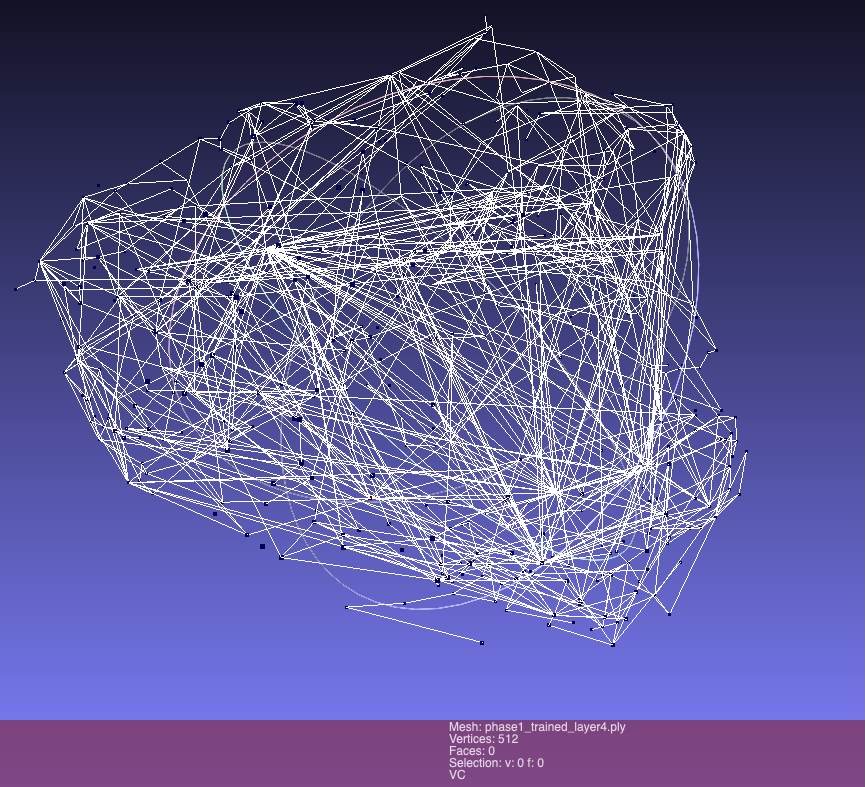

# Functional Geometry in Deep Neural Networks

## Overview

This repository documents an experimental research arc investigating learned functional geometry in deep neural networks. The project demonstrates the existence, causality, and system-level effects of geometric structure that emerges during training, and explores its implications for model compression, interpretability, and plasticity. In this work, functional geometry refers to the structure induced by cosine similarity between neuron activation vectors, where geometric proximity predicts functional interchangeability under intervention.

## Key Measured Results (Summary)

- Single-pair biopsy: ~14× sensitivity separation (Far vs Near merges)
- Batch biopsy: ~5× mean |ΔLoss| separation (Near vs Far cohorts)
- Mass consolidation: ~1.8× stability advantage (geometry-guided vs random)

## 📖 How to Read This Repository

New readers should start with [docs/how_to_read.md](docs/how_to_read.md) for a concise orientation guide to the repository structure, evidence flow, and experimental phases.


## Core Hypothesis

Neural networks learn functional geometry—structured manifolds in activation space that encode redundancy, stiffness, and causal relationships between neurons. This geometry can be:
- **Mapped** through dimensionality reduction and clustering
- **Validated** through targeted surgical interventions
- **Exploited** for safe model consolidation
- **Perturbed** to study plasticity dynamics



*Figure: 3D projection of the Layer 4 activation correlation manifold for a trained ResNet18.  
This image is a visualization aid only; canonical data is provided via the PLY artifacts in `artifacts/ply/`.*

## Experimental Phases

### Phase I: Neuro-Cartography (Manifold Discovery)

**Objective**: Map the functional geometry of trained networks by analyzing activation patterns across layers.

**Primary Evidence (Colab)**:
- `01_neuro_cartography.ipynb` ([Link](https://colab.research.google.com/drive/1Fq1l2yQtmzHF7zrIWcXd_1iyKWYtFNm6?usp=drive_link))
- `02_untrained_baseline_manifold.ipynb` ([Link](https://colab.research.google.com/drive/1aJIFXcehXMtid97zwfKfozseJt2A9L9Q?usp=drive_link))
- `03_pixel_shuffle_control.ipynb` ([Link](https://colab.research.google.com/drive/19qUlvA5l7vMswTg0psYmb-Iw6IEFboEs?usp=drive_link))

**Supporting Material**: 
- Manifold visualizations in `artifacts/ply/`:
  - [phase1_trained_layer4.ply](artifacts/ply/phase1_trained_layer4.ply) (trained semantic manifold)
  - [phase1_untrained_layer4.ply](artifacts/ply/phase1_untrained_layer4.ply) (random-weight baseline)
  - [phase2_pixelshuffle_layer4.ply](artifacts/ply/phase2_pixelshuffle_layer4.ply) (pixel-shuffle control)


### Phase II: Biopsy (Causal Testing)

**Objective**: Validate that geometric proximity predicts functional redundancy through targeted neuron removal.

**Primary Evidence (Colab)**:
- `04_failed_biopsy.ipynb` ([Link](https://colab.research.google.com/drive/110sO1CQ5d8Worg3PrXJY2nmGgRtbdR5M?usp=drive_link))
- `05_neuro_surgeon_biopsy_v2.ipynb` ([Link](https://colab.research.google.com/drive/110sO1CQ5d8Worg3PrXJY2nmGgRtbdR5M?usp=drive_link))

**Supporting Material**:

### Phase III: Mass Consolidation

**Objective**: Scale geometry-guided compression to system level.

**Primary Evidence (Colab)**:
- `06_neuro_surgeon_batch_biopsy.ipynb` ([Link](https://colab.research.google.com/drive/1bxQ-ZOA6lep-b2QhyvM71dj5zt1YI7vc?usp=drive_link))
- `07_neuro_surgeon_mass_consolidation.ipynb` ([Link](https://colab.research.google.com/drive/1VVuKh1WrFA_y182QiERAeHuI7zSVFPiJ?usp=drive_link))

**Supporting Material**:
- `scripts/neuro_surgeon_batch.py`

**Status**: Statistical validation COMPLETE.

### Phase IV: Sleep / Plasticity Test

**Objective**: Investigate whether geometric perturbation affects learning dynamics.

**Primary Evidence (Colab)**:
- `08_neuro_sleep.ipynb` ([Link](https://colab.research.google.com/drive/110sO1CQ5d8Worg3PrXJY2nmGgRtbdR5M?usp=drive_link))

**Supporting Material**:
- `scripts/neuro_sleep.py`

**Status**: COMPLETE (Negative result verified).

## Key Results (Verified)

- Neuron-pair proximity in activation space predicts functional redundancy (≈14× sensitivity gap between near vs. far merges).
- Geometry-guided consolidation is ≈1.8× more stable than random merging at scale (50-pair mass consolidation).
- Learned activation manifolds differ sharply from untrained and pixel-shuffled controls.

## Empirical Results (Measured)

| Experiment | Metric | Result |
|-----------|--------|--------|
| Single-Pair Biopsy | Sensitivity ratio (Far / Near) | ≈ 14× |
| Batch Biopsy (N=50) | Mean |ΔLoss| (Near) | 0.0119 ± 0.0098 |
| Batch Biopsy (N=50) | Mean |ΔLoss| (Far) | 0.0594 ± 0.1377 |
| Mass Consolidation (50 pairs) | Geometry-guided ΔLoss | −0.376 |
| Mass Consolidation (50 pairs) | Random ΔLoss | −0.681 |
| Plasticity Test (5 epochs) | Geometric peak accuracy | 84.7% |
| Plasticity Test (5 epochs) | Random peak accuracy | 86.8% |

"All results are measured directly from intervention experiments and reported as loss or accuracy deltas relative to identical baselines. Negative ΔLoss values indicate improved alignment due to head mismatch and should be interpreted by magnitude, not sign."

## Key Findings

1. **Functional geometry exists**: Neurons organize into structured manifolds in activation space
2. **Geometry predicts redundancy**: Proximal neurons in geometric space exhibit functional overlap
3. **Local merges are safe**: Consolidating nearby neurons preserves performance
4. **Distant merges destabilize**: Merging geometrically distant neurons degrades function
5. **Geometry-guided consolidation works**: Compression informed by manifold structure outperforms naive approaches
6. **Geometric perturbation affects plasticity**: TBD
7. **Geometry encodes stability, not learning speed**: TBD

## What This Is / Is Not

**This is**:
- A mechanistic interpretability study
- An exploration of compression priors
- A demonstration of causal validation methods
- An archive of experimental results with controls

“The term ‘Hebbian’ is used descriptively to denote geometry emerging from correlated activations during training, rather than a specific synaptic update rule.”

**This is not**:
- A claim about biological neural networks
- A general theory of deep learning
- A production-ready compression method
- A complete explanation of network function

## Repository Structure

```
/
├── README.md                          # This file
├── executive_summary.md               # High-level conclusions
├── notebooks/                         # Primary Colab Record (stubs)
│   ├── 01_neuro_cartography.ipynb
│   ├── 02_untrained_baseline_manifold.ipynb
│   ├── 03_pixel_shuffle_control.ipynb
│   ├── 04_failed_biopsy.ipynb
│   ├── 05_neuro_surgeon_biopsy_v2.ipynb
│   ├── 06_neuro_surgeon_batch_biopsy.ipynb
│   ├── 07_neuro_surgeon_mass_consolidation.ipynb
│   └── 08_neuro_sleep.ipynb
├── scripts/                           # Supporting Scripts
│   ├── neuro_surgeon_batch.py
│   └── neuro_sleep.py
├── artifacts/                         # Generated outputs
│   ├── ply/                          # 3D manifold exports
│   └── figures/                      # Plots and visualizations
├── docs/                              # Additional documentation
│   └── research_notes.md
└── LICENSE                            # MIT License
```

## Notebooks & Artifacts

All experimental notebooks are hosted on Google Colab and linked in the respective phase sections above. Manifold visualizations (PLY files) can be found in `artifacts/ply/` and viewed with MeshLab, CloudCompare, or Blender. Static JPG preview images for these artifacts are available in `artifacts/figures/`.

## Status & Future Work

**Completed**:
- Phase I: Manifold discovery and visualization
- Phase II: Causal validation through targeted ablation

**In Progress**:
- Phase III: System-scale consolidation

**Planned**:
- Phase IV: Plasticity and relearning dynamics
- Cross-architecture validation
- Theoretical formalization

## Reproducibility / Environment

For consistent results, please use the environment specified in `requirements.txt`.

```bash
pip install -r requirements.txt
```


## Citation

If you use this work, please cite:

```
@misc{functional-geometry-2026,
  title={Functional Geometry in Deep Neural Networks},
  author={boglim},
  year={2026},
  url={https://github.com/boglim1984/functional-geometry-hebbian-manifold}
}
```

## Repository Status

This repository reflects an active research consolidation phase.

Recent commits focus on:
- aligning notebook coverage with documented phases
- standardizing artifact naming
- improving reader orientation and traceability

The core experimental results are stable as of this release.

## License

MIT License - see [LICENSE](LICENSE) for details.
